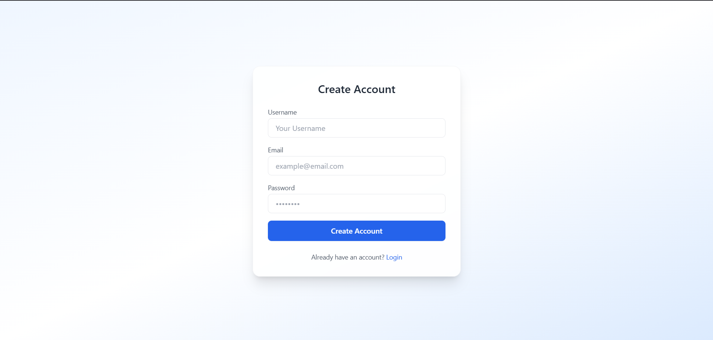
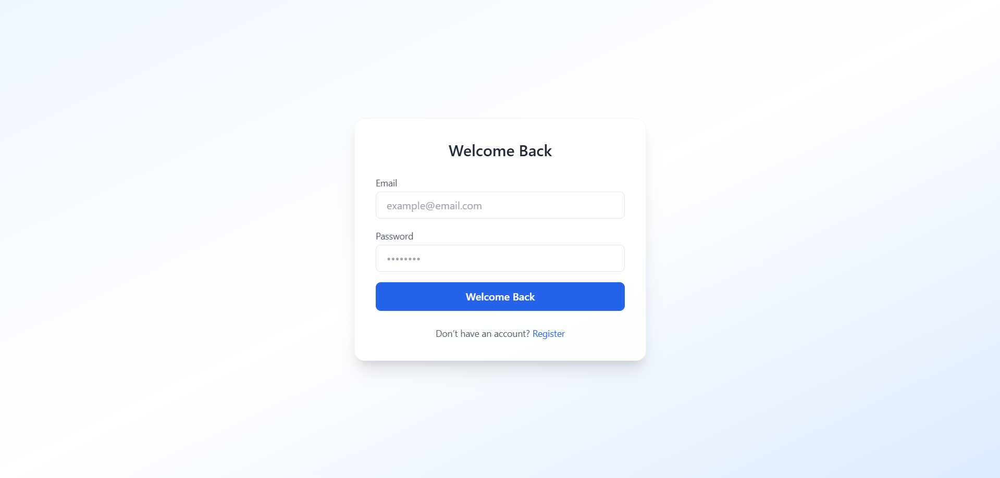
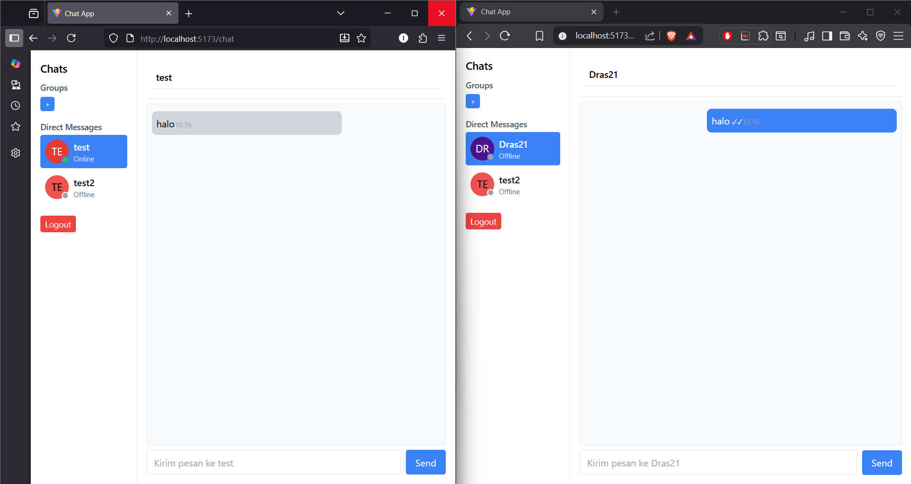
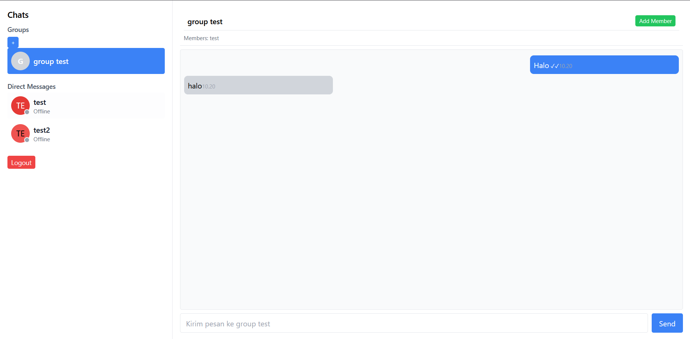
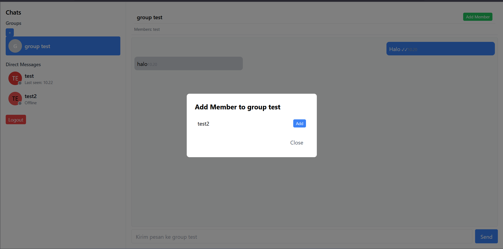
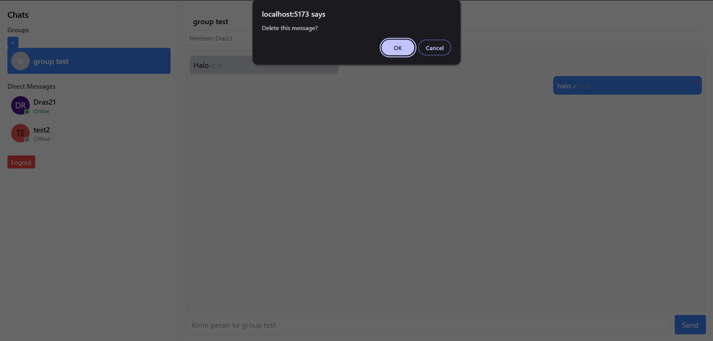
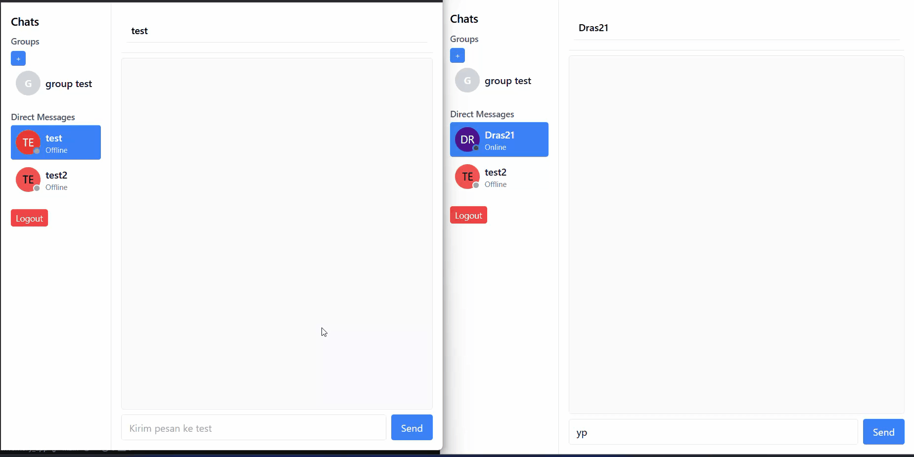

# Chat App — Real-Time Messaging with Groups & Private Chats

A fullstack **real-time chat application** built with **React**, **Node.js (Express)**, **Socket.IO**, and **PostgreSQL**.  
This project demonstrates a complete chat experience including private messaging, group chats, live typing indicators, and message deletion — all connected in real time.  

> Note : *This project was intentionally built in a single main React file for simplicity and demonstration purposes.*
> In a production setup, the frontend would be split into smaller components like `ChatHeader`, `MessageBubble`, `GroupModal`, etc.

---

## Features

- **JWT Authentication**
- **Private & Group Chat**
- **Real-Time Messaging** via Socket.IO
- **Typing Indicator**
- **Online User Status**
- **Delete Message** (real-time removal)
- **Add Members to Group**
- **Responsive Layout** (clean and minimal UI)

---

## Tech Stack

### Frontend
- React + Vite
- Socket.IO Client
- Axios
- Tailwind CSS

### Backend
- Node.js + Express
- Socket.IO
- PostgreSQL + `pg`
- JWT Authentication
- Joi (for validation)
- bcrypt (for password hashing)
- CORS + dotenv

---

## Project Structure
### Backend
```
backend/
├── config/
├── controllers/
├── middleware/
├── routes/
├── validations/
├── server.js
└── package.json
```
### Frontend
This project was developed quickly for a portfolio demo, so most chat logic is in a single React file:
```
frontend/
├── src/
│   ├── components/
│   ├── context/
│   ├── pages/
│   │   └── ChatPage.jsx ← main logic (UI + socket + message handling)
│   ├── services/
│   └── main.jsx
└── package.json
```
---
## Setup Instructions

### Clone the repository
```bash
git clone https://github.com/indra210595/chat-app.git
cd chat-app
```

### Install dependencies

# Backend
cd backend
npm install

# Frontend
cd frontend
npm install

### Create a .env file
# Example for backend:

DB_USER=''
DB_HOST=''
DB_NAME=''
DB_PASSWORD=''
DB_PORT=''
SERVER_PORT=''
JWT_KEY=''

# Example for frontend:
VITE_API_URL=''

### Run both servers
# Backend
npm run dev

# Frontend (Vite)
npm run dev

### Key Backend Endpoints

| Method | Endpoint | Description |
|--------|-----------|-------------|
| **POST** | `/api/auth/register` | Register new user |
| **POST** | `/api/auth/login` | Login & get JWT |
| **GET** | `/api/messages/:userId` | Fetch private messages |
| **GET** | `/api/messages/group/:groupId` | Fetch group messages |
| **POST** | `/api/groups` | Create new group |
| **DELETE** | `/api/messages/:id` | Delete a message (own only) |


### What I Learned

- How to design real-time architectures using Socket.IO.
- Building auth + socket flow with JWT.
- Structuring async operations and state updates in React.
- Handling message synchronization between multiple users.

### Future Improvements

- Edit Message (soft edit + live update)
- File/Image upload
- Push Notifications
- Message read receipts per user
- Refactor frontend into reusable components

## Preview
- Register


- Login


- Private Chat


- Group Chat


- Add Member Group


- Delete Message


- Chat Demo


## Author
**Indra Sadikin**  
Fullstack Developer | Data Enthusiast  
[Portfolio](https://github.com/indra210595)
[Linkedin](www.linkedin.com/in/indra-sadikin-b814a1155)